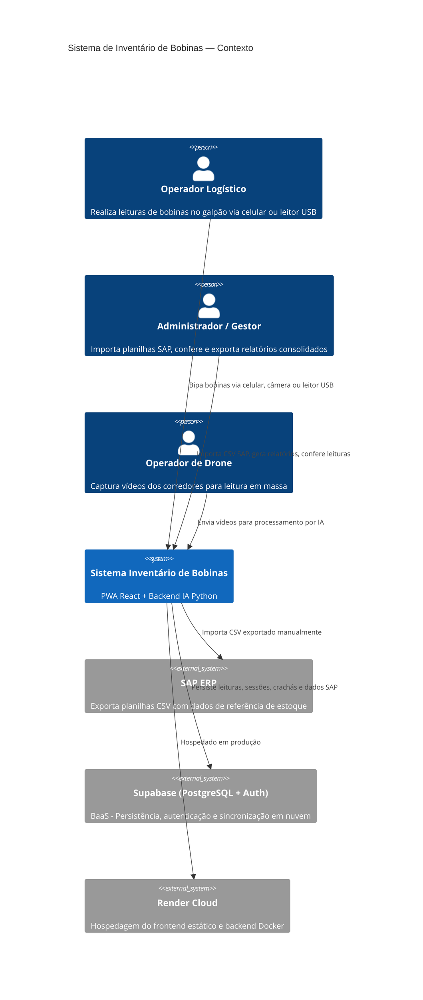
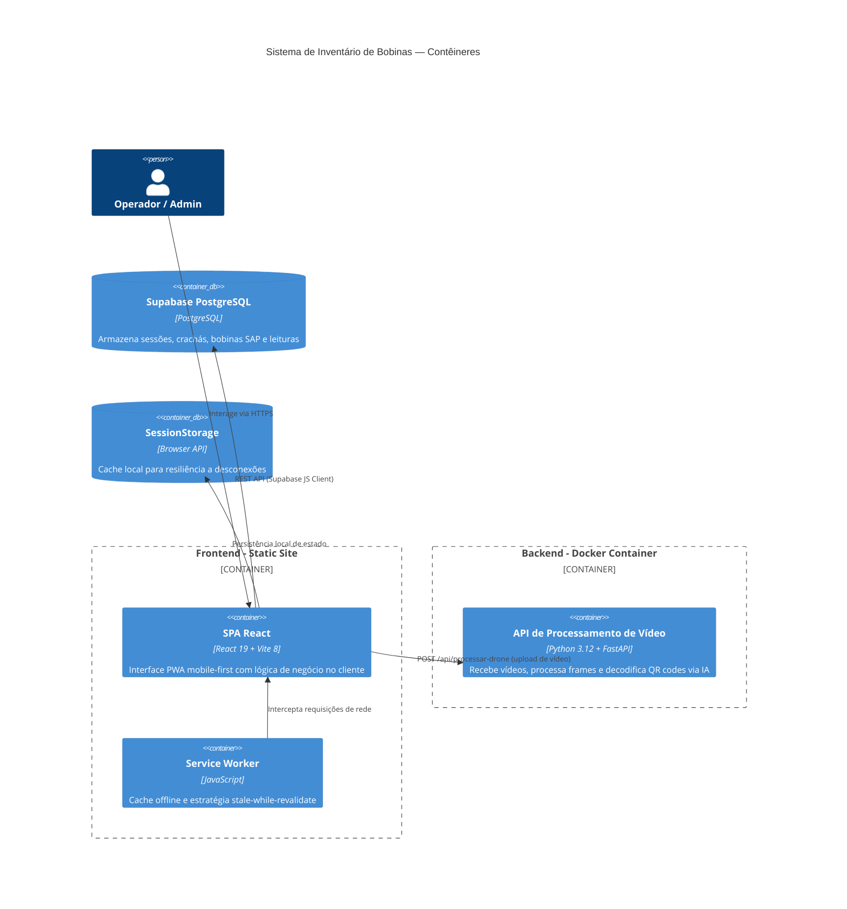
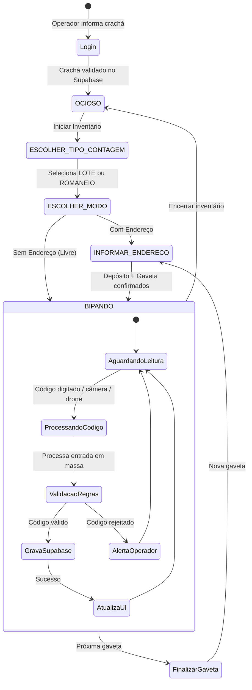
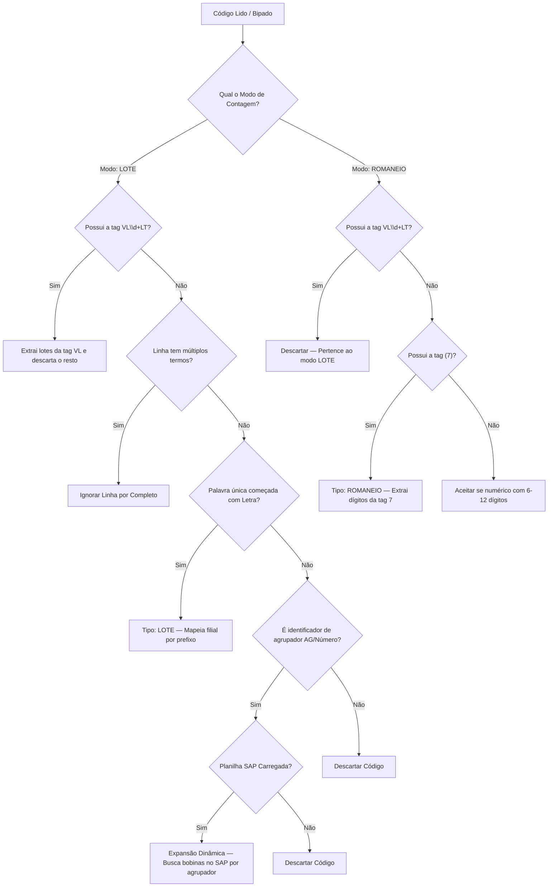
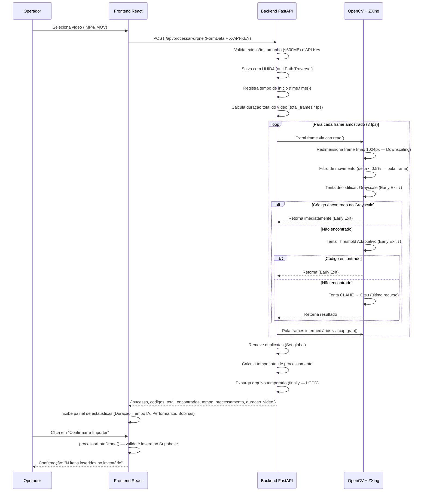

# 📦 VisionStock — Inventário Universal de Almoxarifado

> **Versão 3 (ALMOX universal):** código organizado em módulos (`src/modules/*`, `backend/app/*`) e hospedagem própria com Docker Compose.
> Estrutura atual e regras: [`AGENTS.md`](AGENTS.md) · Hospedagem no servidor Linux: [`docs/DEPLOY-LINUX.md`](docs/DEPLOY-LINUX.md) · Testes: `npm test` e `cd backend && pytest`.
> Partes deste README ainda descrevem a versão de bobinas (Render + túnel Cloudflare) e serão revisadas.


<div align="center">

**Sistema de Inventário Físico e Conciliação de Estoque com Inteligência Artificial**


</div>

---

## 📋 Índice

- [Visão Geral](#-visão-geral-da-solução)
- [Objetivos de Negócio](#-objetivos-de-negócio)
- [Arquitetura](#-arquitetura-atualizada)
- [Fluxos de Funcionamento](#-fluxos-de-funcionamento)
- [Componentes e Responsabilidades](#-componentes-e-responsabilidades)
- [Dependências e Integrações](#-dependências-e-integrações)
- [Requisitos Funcionais e Não Funcionais](#-requisitos-funcionais-e-não-funcionais)
- [Decisões Arquiteturais](#-decisões-arquiteturais-adotadas)
- [Padrões de Projeto](#-padrões-de-projeto-utilizados)
- [Estratégia de Segurança](#-estratégia-de-segurança)
- [Observabilidade](#-estratégia-de-observabilidade)
- [Deploy e Operação](#-processo-de-deploy-e-operação)
- [Melhorias Realizadas](#-melhorias-realizadas-desde-a-versão-inicial)
- [Limitações e Roadmap](#-limitações-conhecidas-e-roadmap-futuro)

---

## 🔭 Visão Geral da Solução

O **Inventário de Bobinas** é um sistema web de alta performance desenvolvido sob medida para a **Videplast** (grupo de embalagens flexíveis com múltiplas filiais no Brasil). A aplicação tem como objetivo central automatizar, agilizar e garantir a integridade do inventário físico de bobinas industriais, realizando a **conciliação em tempo real** entre as leituras físicas (obtidas por leitores de código de barras, câmeras de celular ou drones com IA) e os dados oficiais exportados do sistema **SAP**.

A solução opera como uma **Progressive Web App (PWA)** mobile-first, projetada para uso direto por operadores logísticos dentro de galpões industriais, com resiliência a oscilações de rede (Wi-Fi/4G) e interface otimizada para dispositivos touchscreen.

### Diagrama de Contexto (C4 — Nível 1)



---

## 🎯 Objetivos de Negócio

| # | Objetivo | Descrição |
|---|----------|-----------|
| 1 | **Redução do tempo de inventário** | Substituir processos manuais com papel por leituras digitais em tempo real, reduzindo o ciclo de inventário de dias para horas |
| 2 | **Acurácia de 100%** | Cruzamento inteligente entre dados físicos e SAP para identificar discrepâncias instantaneamente |
| 3 | **Rastreabilidade completa** | Registro de quem bipou, quando, onde e em qual sessão, para auditoria total |
| 4 | **Cobertura de múltiplas filiais** | Suporte nativo a 7 filiais (Videira, Manaus, Três Rios, União da Vitória, Rio Verde, Várzea Grande, Barracão do Lima) |
| 5 | **Escalabilidade de leitura** | Processamento em massa via vídeo de drone com visão computacional (YOLOv8 + ZXing) |
| 6 | **Operação mobile-first** | Sistema projetado para celulares em ambientes industriais ruidosos com conectividade instável |
| 7 | **Dual-mode de contagem** | Suporte a inventário por **Lote** (bobina individual) e por **Romaneio** (carga de expedição) |

---

## 🏗️ Arquitetura Atualizada

### Diagrama de Contêineres (C4 — Nível 2)



### Stack Tecnológico

| Camada | Tecnologia | Versão | Propósito |
|--------|-----------|--------|-----------|
| **Frontend** | React | 19.2 | UI reativa com hooks |
| **Build** | Vite | 8.0 | Bundler ultrarrápido com HMR |
| **UI Framework** | Bootstrap + React-Bootstrap | 5.3 / 2.10 | Layout responsivo e componentes prontos |
| **Ícones** | Bootstrap Icons + React-Bootstrap-Icons | 1.11 | Iconografia consistente |
| **Scanner** | html5-qrcode | 2.3.8 | Leitura de QR/Barcode via câmera do dispositivo |
| **BaaS** | Supabase (PostgreSQL) | 2.99 | Banco de dados, autenticação e API REST |
| **Backend IA** | Python + FastAPI | 3.12 / 0.139 | Microsserviço de processamento de vídeo |
| **Visão Computacional** | OpenCV + ZXing-C++ | 4.11 / 3.1 | Processamento de imagem e decodificação de códigos |
| **Containerização** | Docker | Python 3.12-slim | Empacotamento do backend |
| **Hospedagem** | Render | — | Static Site (frontend) + Web Service (backend) |
| **PWA** | Service Worker + Manifest | — | Instalável como app nativo |

---

## 🔄 Fluxos de Funcionamento

### Fluxo Principal de Inventário



### Fluxo de Decisão — Identificação de Códigos (Modo LOTE)



### Fluxo de Processamento de Drone (v2.2 — Pipeline Progressivo)



---

## 🧩 Componentes e Responsabilidades

### Frontend (React SPA)

| Componente | Arquivo | Responsabilidade |
|-----------|---------|------------------|
| **App** | `src/App.jsx` | Componente raiz com toda a máquina de estados do inventário, lógica de negócio, importação CSV, conciliação e renderização condicional |
| **Header** | `src/components/Header.jsx` | Exibe logotipo corporativo da Videplast |
| **Scanner** | `src/components/Scanner.jsx` | Encapsula o `html5-qrcode` para leitura via câmera traseira (`facingMode: environment`) com tratamento de permissão e lifecycle seguro |
| **ProcessadorDrone** | `src/components/ProcessadorDrone.jsx` | Interface de upload de vídeo, comunicação com o backend de IA e exibição de painel de estatísticas pós-análise (duração do vídeo, tempo de IA, performance, bobinas detectadas) |
| **FilterControls** | `src/components/FilterControls.jsx` | Controles de filtro e ordenação para o painel de conferência administrativa |
| **Supabase Client** | `src/supabase.js` | Inicialização do cliente Supabase com variáveis de ambiente |

### Backend (Python FastAPI)

| Módulo | Arquivo | Responsabilidade |
|--------|---------|------------------|
| **API FastAPI** | `backend/main.py` | Endpoint `POST /api/processar-drone` com autenticação X-API-KEY, validação de upload, processamento de vídeo e retorno de métricas de performance |
| **Decodificador Progressivo** | `decodificar_frame()` | Pipeline de Early Exit: tenta Grayscale → Threshold Adaptativo → CLAHE → Otsu, parando no primeiro sucesso para maximizar velocidade |
| **Métricas de Tempo** | `time.time()` | Captura `tempo_processamento` (latência real da IA) e `duracao_video` (via `total_frames / fps`) e os retorna no JSON de resposta |

---

## 🔗 Dependências e Integrações

### Integrações Externas

| Sistema | Tipo | Protocolo | Descrição |
|---------|------|-----------|-----------|
| **SAP ERP** | Offline | CSV (`;` ou `,` delimitado) | Importação manual de planilhas com dados de referência de estoque |
| **Supabase** | Online | REST HTTPS | BaaS para persistência, autenticação de crachás e sincronização em nuvem |
| **Backend IA** | Online | REST HTTPS | Microsserviço de processamento de vídeo do drone |

### Tabelas Supabase (Modelo de Dados)

| Tabela | Descrição |
|--------|-----------|
| `crachas` | Cadastro de operadores (`id`, `nome_completo`, `admin`) |
| `sessoes_inventario` | Sessões de inventário (`id`, `cracha_importacao`, `status`) |
| `bobinas_sap` | Dados importados da planilha SAP (lote, romaneio, material, etc.) |
| `bobinas_lidas` | Registros de leituras realizadas pelos operadores |
| `depositos` | Cadastro de depósitos com flag `requer_endereco` |
| `rotas` | Cadastro de rotas logísticas |

---

## ✅ Requisitos Funcionais e Não Funcionais

### Requisitos Funcionais

| RF | Descrição |
|----|-----------|
| RF-01 | Autenticação por crachá corporativo contra base Supabase |
| RF-02 | Importação de CSV do SAP com detecção automática de encoding e delimitador |
| RF-03 | Leitura de códigos via leitor USB, câmera do celular e drone com IA |
| RF-04 | Contagem dual-mode: por Lote ou por Romaneio |
| RF-05 | Inventário com ou sem endereçamento (Depósito/Gôndola/Gaveta) |
| RF-06 | Conciliação automática com 4 status: OK, Faltando, Sobra, Local Incorreto |
| RF-07 | Exportação de relatório conciliado em CSV compatível com Excel brasileiro |
| RF-08 | Painel de conferência administrativa com filtros e paginação |
| RF-09 | Expansão dinâmica de agrupadores em lotes individuais |
| RF-10 | Mapeamento automático de filial por prefixo de lote |
| RF-11 | Suporte a rotas logísticas na contagem endereçada |

### Requisitos Não Funcionais

| RNF | Categoria | Descrição | Mecanismo |
|-----|-----------|-----------|-----------|
| RNF-01 | **Performance** | Tempo de bipagem < 500ms por código | Lógica local no frontend + insert assíncrono no Supabase |
| RNF-02 | **Disponibilidade** | Operação contínua mesmo com oscilação de rede | SessionStorage como fallback + Service Worker com cache |
| RNF-03 | **Usabilidade** | Interface otimizada para telas de 5" a 7" | Mobile-first design com cards verticais e botões táteis |
| RNF-04 | **Compatibilidade** | Suporte a Chrome, Safari e Samsung Internet | HTML5 standards + Bootstrap 5 responsivo |
| RNF-05 | **Escalabilidade** | Suporte a milhares de bobinas por sessão | Paginação de 50 itens + processamento em lote |
| RNF-06 | **Internacionalização** | Compatibilidade com encoding brasileiro | ISO-8859-1 / UTF-8 com BOM (`\uFEFF`) na exportação |

---

## 🧭 Decisões Arquiteturais Adotadas

### ADR-01: Lógica de Negócio no Frontend

**Decisão**: Toda a lógica de validação, parsing e conciliação reside no React (`App.jsx`).

**Justificativa**: O backend é um microsserviço stateless focado exclusivamente em visão computacional. Manter as regras de negócio no frontend permite operação parcial offline via SessionStorage e reduz a latência de validação a zero (sem round-trip de rede).

**Trade-off**: O frontend (`App.jsx`) é um componente monolítico de ~1700 linhas, o que impacta a manutenibilidade.

---

### ADR-02: Supabase como BaaS

**Decisão**: Utilizar Supabase (PostgreSQL gerenciado) em vez de backend customizado com ORM.

**Justificativa**: Reduz drasticamente o time-to-market ao eliminar a necessidade de construir API REST, autenticação e migrations. O Supabase JS Client oferece inserção e consulta direta do frontend com RLS (Row Level Security) disponível.

---

### ADR-03: PWA com Service Worker Manual

**Decisão**: Implementar Service Worker manualmente com estratégia stale-while-revalidate em vez de usar workbox ou vite-plugin-pwa.

**Justificativa**: Controle total sobre o cache de assets estáticos sem dependência de bibliotecas adicionais. A estratégia permite que o operador continue usando o app mesmo com rede instável no galpão.

---

### ADR-04: Processamento de Drone como Microsserviço Separado

**Decisão**: Backend Python com FastAPI containerizado em Docker, separado do frontend.

**Justificativa**: O processamento de vídeo com OpenCV e YOLOv8 requer dependências pesadas de sistema (libgl, g++, cmake) incompatíveis com um ambiente Node.js. A separação permite escalar o backend independentemente do frontend.

---

### ADR-05: ZXing-C++ em vez de ZXing-JS

**Decisão**: Utilizar `zxing-cpp` (binding Python para C++) no backend em vez de ZXing-JS.

**Justificativa**: Performance 10-50x superior na decodificação de códigos em frames de vídeo de alta resolução. Essencial para processar vídeos de drone com latência aceitável. O pipeline progressivo (Early Exit) evita gerar filtros de imagem pesados quando o frame já é decodificável na versão Grayscale simples, reduzindo o tempo médio por frame de ~150ms para ~20ms nos trechos nítidos.

---

### ADR-06: Arquitetura Offline-First com Dexie.js (IndexedDB) (v2.3)

**Decisão**: Substituir inserções síncronas diretas do Supabase por um fluxo local-first usando o Dexie.js para gerenciar tabelas IndexedDB locais.

**Justificativa**: Em galpões de expedição da Videplast, a rede Wi-Fi/celular oscila frequentemente. Salvar diretamente no banco de dados remoto gerava travamentos e perda de dados. Com a nova arquitetura, o dado é persistido localmente e enfileirado na tabela de pendências, com sincronização em lote automatizada assim que a conectividade é restabelecida.

---

### ADR-07: Tolerância a Falhas na Validação de Sessão (v2.3)

**Decisão**: Ajustar a função `garantirSessao()` para não consultar o servidor Supabase em caso de desconexão ativa, confiando no `sessaoId` presente na memória do navegador.

**Justificativa**: No fluxo original, mesmo gravando localmente, o app tentava conferir se a sessão existia remotamente no banco antes de aceitar a leitura. Isso quebrava o fluxo offline ao lançar uma exceção de rede. Ao pular essa validação em modo offline, garantimos resiliência total para o operador.

---

## 🔲 Padrões de Projeto Utilizados

| Padrão | Onde é Aplicado | Descrição |
|--------|-----------------|-----------|
| **State Machine** | `etapaInventario` | Máquina de estados finitos para controlar o fluxo de inventário (OCIOSO → ESCOLHER_TIPO → ESCOLHER_MODO → INFORMAR_ENDERECO → BIPANDO) |
| **Strategy** | `processarEntradaMassa()` | Algoritmo de parsing que alterna entre estratégia LOTE e ROMANEIO baseado em `tipoContagem` |
| **Observer** | `useEffect` hooks | Efeitos colaterais reativos para sincronização com SessionStorage e Supabase |
| **Facade** | `supabase.js` | Abstração simplificada do cliente Supabase para o restante da aplicação |
| **Pipeline/Chain** | `gerar_variacoes_imagem()` | Pipeline de processamento de imagem com variações sequenciais (Grayscale → CLAHE → Otsu → Adaptativo) |
| **Template Method** | `decodificar_frame()` | Orquestrador que aplica o pipeline de variações e tenta decodificar cada uma com ZXing |
| **Batch Processing** | `processarLoteDrone()` | Processamento em lote dos códigos retornados pelo drone com deduplicação e inserção em massa |

---

## 🔐 Estratégia de Segurança & Hardening

| Aspecto | Implementação / Detalhamento do Hardening |
|---------|-------------------------------------------|
| **Autenticação de API** | API Key obrigatória via cabeçalho `X-API-KEY` para requisições no backend de drone, protegendo contra uso não autorizado |
| **Autenticação de Operador** | Validação rápida de crachá contra tabela `crachas` no Supabase com atribuições de `admin` |
| **Controle de CORS** | Restrito para o domínio de produção oficial da Videplast no Render e localhost do ambiente de desenvolvimento |
| **Proteção de Uploads (DoS)** | Limite de tamanho de arquivo travado em **600MB** (lido em chunks) e whitelisting estrito de extensões permitidas (`.mp4`, `.mov`, `.avi`) |
| **Segurança contra Path Traversal** | Geração automática de UUID4 para nomear arquivos de vídeo temporários, prevenindo sobrescritas e injeção de caminhos |
| **Robustez de Dados (LGPD)** | Bloco `finally` estrutural garante o expurgo imediato do arquivo de vídeo temporário após processamento, sem persistência residual |
| **Sanitização de Dados (Anti-Injeção)** | Sanitização inteligente de caracteres especiais no backend via expressão regular, permitindo apenas formatos válidos (letras, números, delimitadores, parênteses do negócio) |
| **Transporte de Dados** | Tráfego estritamente via HTTPS (TLS 1.3) para acesso à câmera e comunicação segura com o Supabase e Microsserviço |

---

## 📊 Estratégia de Observabilidade

| Pilar | Implementação Atual | Cobertura |
|-------|---------------------|-----------|
| **Logs** | `console.error` / `console.warn` no frontend; `print()` no backend | ⚠️ Básica — sem agregação centralizada |
| **Métricas de Negócio** | Contadores em tela (Esperadas / Lidas / Faltam) | ✅ Visual em tempo real |
| **Rastreabilidade** | Cada leitura registra `cracha_leitura`, `created_at`, `sessao_id`, `deposito`, `endereco_lido`, `rota` | ✅ Auditoria completa |
| **Monitoramento de Infra** | Render Dashboard (eventos de deploy, logs de build, uptime) | ⚠️ Básico |
| **Alertas** | Não implementado | ❌ |

---

## 🚀 Processo de Deploy e Operação

### Frontend (Static Site — Render)

```bash
# Build local
npm run build   # Gera /dist com assets otimizados pelo Vite

# Deploy: O Render detecta push no branch principal e executa o build automaticamente
# Configuração no Render:
#   Build Command: npm install && npm run build
#   Publish Directory: dist
```

### Backend (Docker — Render Web Service)

```dockerfile
# Imagem base leve
FROM python:3.12-slim

# Dependências de sistema para OpenCV e ZXing-C++
RUN apt-get update && apt-get install -y --no-install-recommends \
    libgl1 libglib2.0-0 libsm6 libxext6 libxrender-dev cmake g++

# Instala dependências Python
COPY requirements.txt .
RUN pip install --no-cache-dir -r requirements.txt

COPY . .
CMD ["sh", "-c", "uvicorn main:app --host 0.0.0.0 --port ${PORT:-8000}"]
```

### Variáveis de Ambiente Necessárias

| Variável | Onde | Descrição |
|----------|------|-----------|
| `VITE_SUPABASE_URL` | Frontend | URL do projeto Supabase |
| `VITE_SUPABASE_ANON_KEY` | Frontend | Chave anônima/service_role do Supabase |
| `VITE_API_URL` | Frontend | URL do backend de processamento de drone |
| `PORT` | Backend | Porta HTTP (definida automaticamente pelo Render) |

---

## 📈 Melhorias Realizadas desde a Versão Inicial

| Versão | Melhoria | Impacto |
|--------|----------|---------|
| v2.3 | **Offline-First com Dexie.js (IndexedDB)** | Permite que operadores continuem bipando bobinas sem conexão Wi-Fi. Os dados são salvos localmente e sincronizados em lote no background quando a conexão volta. |
| v2.3 | **Bypass Offline de Validação de Sessão** | `garantirSessao` ignora consultas remotas ao Supabase e confia na sessão local caso a rede caia, eliminando erros no meio de bipagens. |
| v2.2 | **Pipeline de Decodificação Progressivo (Early Exit)** | Abandona filtros de imagem pesados assim que um código é encontrado no frame; reduz tempo médio por frame de ~150ms para ~20ms em trechos nítidos |
| v2.2 | **Taxa de Amostragem Reduzida (5 fps → 3 fps)** | Redução de ~40% no volume de frames processados sem perda de cobertura de detecção |
| v2.2 | **Painel de Estatísticas Pós-Análise** | Frontend exibe Duração do Vídeo, Tempo de Análise da IA, Performance (Nx veloz) e Bobinas Detectadas antes de importar |
| v2.2 | **Métricas de Performance no Backend** | Endpoint retorna `tempo_processamento` e `duracao_video` calculados via `time.time()` e `total_frames / fps` |
| v2.1 | **Otimização de Processamento de Drone** | Downscaling inteligente para 1024px + avanço via `cap.grab()` (redução de até 80% do uso de CPU) |
| v2.0 | **Dual-mode de contagem** (Lote + Romaneio) | Suporte a novos fluxos operacionais de expedição |
| v2.0 | **Sistema de Rotas** | Possibilita validação cruzada de posição SAP com rota + gaveta |
| v2.0 | **Validação inteligente de endereço** | Cruzamento Rota-Gaveta vs Posição SAP para detecção de "Local Incorreto" |
| v2.0 | **Expansão dinâmica de agrupadores** | Leitura de um único QR code expande automaticamente em N lotes |
| v1.5 | **Processamento de drone com IA** | Leitura em massa via vídeo, eliminando bipagem manual corredor por corredor |
| v1.5 | **Pipeline de variações de imagem** | CLAHE + Otsu + Threshold Adaptativo para maximizar decodificação em condições adversas |
| v1.5 | **Filtro de movimento do drone** | Ignora frames estáticos (< 0.5% variação de pixels) para otimizar performance |
| v1.0 | **PWA com Service Worker** | App instalável com cache offline |
| v1.0 | **Visualização híbrida** | Tabela em desktop, cards verticais em mobile |
| v1.0 | **Design System Videplast** | Paleta corporativa (#e20909), glassmorphism, DM Sans/Mono |

---

## ⚠️ Limitações Conhecidas e Roadmap Futuro

### Limitações Atuais

| # | Limitação | Severidade | Descrição |
|---|-----------|-----------|-----------|
| L-01 | **Monolito frontend** | 🟡 Média | `App.jsx` com ~1700 linhas concentra toda a lógica — dificulta manutenção e testes |
| L-02 | **CORS permissivo** | 🔴 Alta | Backend aceita `allow_origins=["*"]` — deveria restringir ao domínio de produção |
| L-03 | **Sem autenticação JWT** | 🟡 Média | Login por crachá sem token — não há expiração de sessão |
| L-04 | **Sem testes automatizados** | 🟡 Média | Nenhum teste unitário ou de integração |
| L-05 | **Service Worker básico** | 🟢 Baixa | Cache apenas de assets estáticos, sem sincronização de dados offline |
| L-06 | **Sem CI/CD formal** | 🟡 Média | Deploy via Render auto-deploy sem pipeline de validação |
| L-07 | **Chave `service_role` no frontend** | 🔴 Alta | O `.env` utiliza `service_role` indevidamente no frontend |
| L-08 | **Sem rate limiting** | 🟡 Média | Backend de processamento de drone sem proteção contra abuso |

### Roadmap Futuro

| Prazo | Melhoria Planejada |
|-------|-------------------|
| **Q3 2026** | Refatoração do `App.jsx` em módulos menores com custom hooks |
| **Q3 2026** | Implementação de testes com Vitest + Testing Library |
| **Q4 2026** | Migração para `anon` key com Row Level Security (RLS) no Supabase |
| **Q4 2026** | Restringir CORS para domínios de produção |
| **Q1 2027** | Pipeline CI/CD com GitHub Actions (lint + test + build + deploy) |
| **Q1 2027** | Observabilidade com Sentry (frontend) e logging estruturado (backend) |
| **Q2 2027** | Modo offline completo com IndexedDB e sync automático |
| **Q2 2027** | Dashboard analítico com gráficos de progresso de inventário em tempo real |

---

## 🗂️ Mapeamento de Filiais

| Prefixo do Lote | Código da Filial | Nome da Unidade |
|:---:|:---:|:---|
| **MA** | `1003` | Manaus |
| **VA** | `1001` | Videira |
| **TA** | `1007` | Três Rios |
| **UA** ou **UV** | `1006` | União da Vitória |
| **RA** | `1005` | Rio Verde |
| **ZA** | `1009` | Várzea Grande |
| **FA** | `1010` | Barracão do Lima |
| Qualquer outro | `1001` | Videira (default) |

---

## 📄 Licença

Projeto proprietário — **Videplast Indústria de Embalagens Ltda.** — Todos os direitos reservados.
